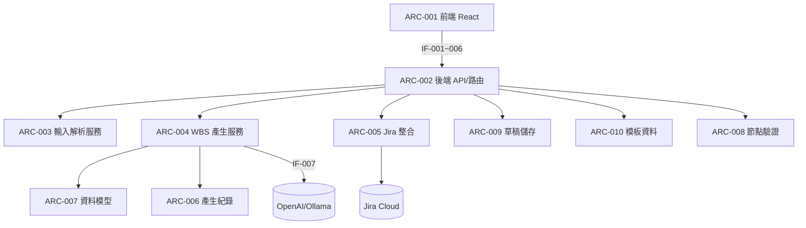

# 02 軟體架構設計（ASPICE SWE.2 / ISO 26262-6 §7）

> 最後更新：2026-06-01 ｜ 對應 git：9bdeecc ｜ 由 skill：record-architecture

## 架構概觀
PM-Agent 分為前端（React+Vite+TS）與後端（FastAPI）。後端以路由層（routers）接收請求，委派給服務層（services）處理輸入解析、LLM 產生 WBS、Jira 部署；資料模型（models）與驗證（validation）橫跨各層；草稿以 JSON 檔持久化。

## 元件相依圖

## 元件清單
### ARC-001 前端
- 職責：三頁流程 UI（輸入需求 → WBS 檢視/編輯/指派 → 部署 Jira）。
- 原始碼：`frontend/src/`（`pages/Intake.tsx`, `WbsReview.tsx`, `Deploy.tsx`, `api/client.ts`）
- 對外介面：使用 IF-001~IF-006 ｜ 相依：ARC-002

### ARC-002 後端 API / 路由
- 職責：FastAPI app 與路由註冊、CORS、健康檢查。
- 原始碼：`backend/app/main.py`, `backend/app/routers/{intake,wbs,jira,templates}.py`, `backend/app/config.py`
- 提供介面：IF-001~IF-006 ｜ 相依：ARC-003,004,005,008,009,010
- 對應需求：SR-001, SR-008

### ARC-003 輸入解析服務
- 職責：把 text/docx/pdf/xlsx/md 正規化為純文字，並從 Excel 抽交付物。
- 原始碼：`backend/app/services/parser.py`
- 提供介面：`parse_text`, `parse_upload` ｜ 對應需求：SR-001, SR-002

### ARC-004 WBS 產生服務
- 職責：呼叫 LLM（JSON 模式）產 WBS，正規化雜格式、組樹、防呆、排程約束、產生紀錄。
- 原始碼：`backend/app/services/wbs_generator.py`
- 提供介面：`generate_wbs`, `parse_wbs_content` ｜ 使用 IF-007（LLM）
- 對應需求：SR-003, SR-004, SR-005, SR-006

### ARC-005 Jira 整合
- 職責：Jira Cloud REST v3 封裝；建 issue 階層、Version、label、狀態 transition。
- 原始碼：`backend/app/services/jira_client.py`, `backend/app/routers/jira.py`
- 對應需求：SR-008

### ARC-006 產生紀錄
- 職責：把每次產生的請求與模型原始輸出寫 JSONL，供回測。
- 原始碼：`backend/app/services/gen_log.py` ｜ 對應需求：SR-009

### ARC-007 資料模型
- 職責：Pydantic schema（WbsNode, Milestone, WbsDraft, 請求/回應）。
- 原始碼：`backend/app/models.py`

### ARC-008 節點驗證
- 職責：逐節點驗證型別、負責單位、日期區間、依賴一致性，回傳問題清單。
- 原始碼：`backend/app/validation.py` ｜ 對應需求：SR-007

### ARC-009 草稿儲存
- 職責：WBS 草稿以 JSON 檔持久化（建立/讀取/列出）。
- 原始碼：`backend/app/store.py`

### ARC-010 模板資料
- 職責：預設工作流模板與組織單位清單。
- 原始碼：`backend/app/templates_data.py`

## 介面清單
| IF | 名稱 | 提供者 | 使用者 | 規格 | 資料 |
|---|---|---|---|---|---|
| IF-001 | 需求輸入 | ARC-002 | ARC-001 | `POST /api/intake` | DF-001→DF-002 |
| IF-002 | 產生 WBS | ARC-002 | ARC-001 | `POST /api/wbs/generate` | DF-002→DF-003 |
| IF-003 | 讀寫草稿 | ARC-002 | ARC-001 | `GET/PUT /api/wbs/{id}` | DF-004 |
| IF-004 | Jira meta | ARC-002 | ARC-001 | `GET /api/jira/projects`, `/meta` | — |
| IF-005 | 部署 Jira | ARC-002 | ARC-001 | `POST /api/jira/deploy` | DF-005 |
| IF-006 | 模板 | ARC-002 | ARC-001 | `GET /api/templates/*` | — |
| IF-007 | LLM 呼叫 | OpenAI/Ollama | ARC-004 | `chat.completions`（JSON 模式） | DF-003 |
