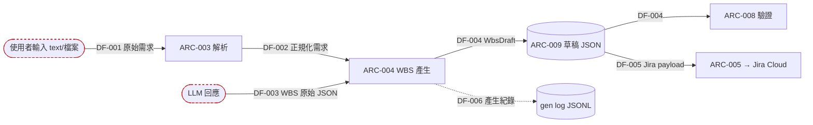

# 03 資料流（ASPICE SWE.2/SWE.3 / ISO 26262-6 §7/§8）

> 最後更新：2026-06-01 ｜ 對應 git：9bdeecc ｜ 由 skill：record-dataflow

## 主要資料流圖

## 資料項清單
### DF-001 原始需求輸入
- 路徑：使用者 → ARC-003（IF-001）
- 結構：純文字，或上傳檔 bytes（docx/pdf/xlsx/md）
- 信任：**不可信**（外部輸入）→ 驗證點：`routers/intake.py`（空檔/格式檢查）、`parser.parse_upload`（副檔名分派、解析例外捕捉）
- 追溯：IF-001, ARC-003 ｜ 驗證測試：TC-001, TC-002

### DF-002 正規化需求文字
- 路徑：ARC-003 → ARC-004（IF-002）
- 結構：純文字（+ Excel 抽出之交付物清單）
- 信任：已正規化 ｜ 追溯：ARC-003→ARC-004

### DF-003 WBS 原始 JSON（LLM 輸出）
- 路徑：LLM（IF-007）→ ARC-004
- 結構：JSON（nodes 扁平清單 + milestones）
- 信任：**不可信**（模型輸出可能雜亂/截斷）→ 驗證點：`wbs_generator.parse_wbs_content`（抽 JSON）、`_normalize_tool_input`（容錯正規化）、`_build_tree`（空節點過濾、型別防呆）
- 追溯：IF-007, ARC-004 ｜ 驗證測試：TC-006~TC-018, 回測 TC-026~TC-027

### DF-004 WbsDraft
- 路徑：ARC-004 → ARC-009（儲存）/ ARC-008（驗證）/ ARC-001（前端編輯，IF-003）
- 結構：`WbsDraft`（Pydantic）｜ 追溯：ARC-007

### DF-005 Jira issue payload
- 路徑：ARC-005 → Jira Cloud（IF-005）
- 結構：Jira REST v3 fields（issuetype, summary, labels, parent, fixVersions）
- 信任：送外部服務 ｜ 追溯：ARC-005

### DF-006 產生紀錄
- 路徑：ARC-004 → gen log JSONL（ARC-006）
- 結構：{ts, model, request, raw_content, node_count, success, attempts}｜ 追溯：SR-009

## 信任邊界與驗證
| 邊界 | 不可信輸入 | 驗證/防護 | 測試覆蓋 |
|---|---|---|---|
| 外部 → 系統 | DF-001 上傳檔/文字 | 空檔檢查、副檔名分派、解析例外捕捉 | TC-001, TC-002 |
| LLM → 系統 | DF-003 模型 JSON | 抽 JSON、容錯正規化、空節點過濾、型別/欄位防呆 | TC-006~TC-018, TC-026~027 |
| 系統 → Jira | DF-005 | label 空白轉底線、逐筆錯誤不中斷 | （無自動化測試 — 見稽核缺口） |
